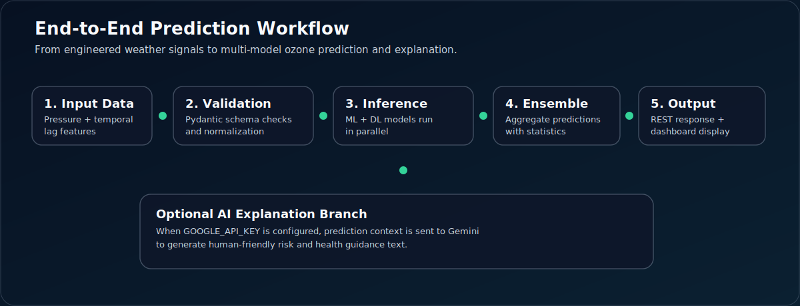
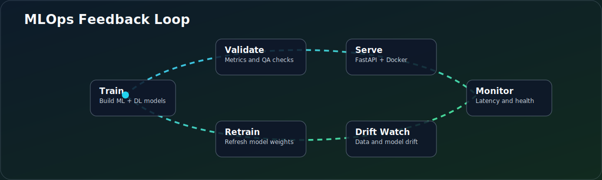

# Ozone Prediction API

Production-ready FastAPI service for atmospheric ozone forecasting with machine learning, deep learning, and optional AI-generated explanations.

[](https://www.python.org/)
[](https://fastapi.tiangolo.com/)
[](https://www.docker.com/)
[](LICENSE)

<p align="center">
  
</p>

## What this project does

This API predicts ozone concentration (`ppbv`) using:

- 5 classical ML models (`dummy_baseline`, `linear_regression`, `decision_tree`, `random_forest`, `xgboost`)
- 3 DL models (`neural_network`, `lstm`, `gru`)
- Ensemble prediction and model-to-model comparison
- Optional natural-language explanations powered by Google Gemini

It also includes a web dashboard (`index.html`, `dashboard.html`) and Docker support for deployment.

## Visual workflow

### Prediction pipeline 



### MLOps lifecycle



## Features

- FastAPI with typed request/response schemas
- Single-model, all-model, and ensemble prediction endpoints
- Batch prediction endpoint
- AI explanation endpoints
- Health and system info endpoints
- Config via environment variables
- Dockerfile and docker-compose for easy deployment

## Tech stack

- Python 3.11+
- FastAPI + Uvicorn
- scikit-learn, XGBoost, TensorFlow/Keras
- Pydantic + pydantic-settings
- Google Generative AI SDK (optional)

## Project structure

```text
ozone-api/
├── app.py
├── config.py
├── schemas.py
├── model_manager.py
├── services.py
├── requirements.txt
├── .env.example
├── Dockerfile
├── docker-compose.yml
├── index.html
├── dashboard.html
├── train_models.py
├── test_api.py
├── validate_system.py
└── README.md
```

## Quick start

### 1. Clone and install

```bash
git clone https://github.com/<your-username>/ozone-api.git
cd ozone-api
python -m venv .venv
```

Windows:

```bash
.venv\Scripts\activate
```

macOS/Linux:

```bash
source .venv/bin/activate
```

Install dependencies:

```bash
pip install -r requirements.txt
```

### 2. Configure environment

Create `.env` from template:

```bash
cp .env.example .env
```

Set values in `.env`:

```ini
GOOGLE_API_KEY=your_google_api_key_here
DEBUG=False
HOST=0.0.0.0
PORT=8000
ML_MODELS_PATH=./models/
DL_MODELS_PATH=./models/
SCALER_PATH=./models/scaler.pkl
```

Note: `GOOGLE_API_KEY` is optional unless you use explanation endpoints.

### 3. Prepare models

Place trained model files in `models/` or train them:

```bash
python train_models.py
```

### 4. Run API

```bash
python app.py
```

Or with Uvicorn:

```bash
uvicorn app:app --host 0.0.0.0 --port 8000
```

Docs:

- Swagger UI: `http://localhost:8000/docs`
- ReDoc: `http://localhost:8000/redoc`

## API endpoints

### System

- `GET /`
- `GET /health`
- `GET /info`

### Predictions

- `POST /predict/{model_name}`
- `POST /predict-all`
- `POST /predict-ensemble`
- `POST /batch-predict/{model_name}`
- `POST /compare-models`

### Explanations

- `POST /explain/{model_name}`
- `POST /explain-ensemble`

## Example request

```bash
curl -X POST "http://localhost:8000/predict/random_forest" \
  -H "Content-Type: application/json" \
  -d @sample_request.json
```

## Docker

Build:

```bash
docker build -t ozone-api:latest .
```

Run:

```bash
docker run --rm -p 8000:8000 --env-file .env ozone-api:latest
```

Compose:

```bash
docker-compose up -d
```

## Testing

```bash
python test_api.py
python validate_system.py
```
## MOdel Performence

## Performance Results

| Model | Type | R² Score | MAE (ppbv) | RMSE (ppbv) |
|-------|------|----------|-----------|------------|
| dummy_baseline | ML | -0.0013 | 6.2229 | 7.3603 |
| linear_regression | ML | 0.8075 | 2.7000 | 3.2273 |
| decision_tree | ML | 0.9334 | 1.2425 | 1.8983 |
| random_forest | ML | 0.9752 | 0.8392 | 1.1591 |
| xgboost | ML | 0.9902 | 0.5441 | 0.7282 |
| neural_network | DL | 0.9902 | 0.5352 | 0.7287 |
| lstm | DL | 0.8481 | 2.3463 | 2.8669 |
| gru | DL | 0.9914 | 0.4894 | 0.6811 |


## Dataset
Source: [Air Quality Data](https://data.nasa.gov/dataset/?tags=atmosphere)  
Records: 539,808 rows · 1994–2021 · Western North America  


## License

MIT. See [LICENSE](LICENSE).
